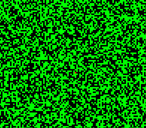
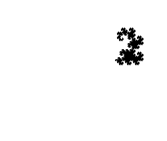
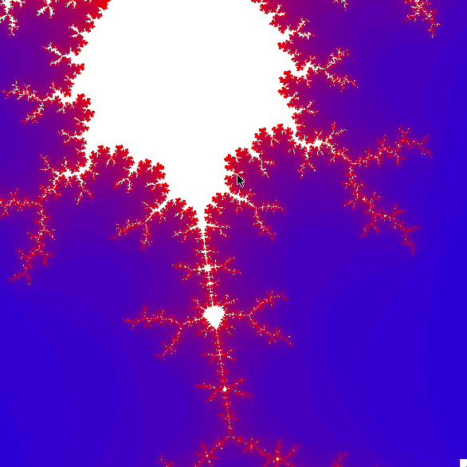
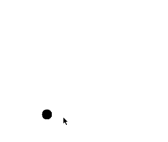
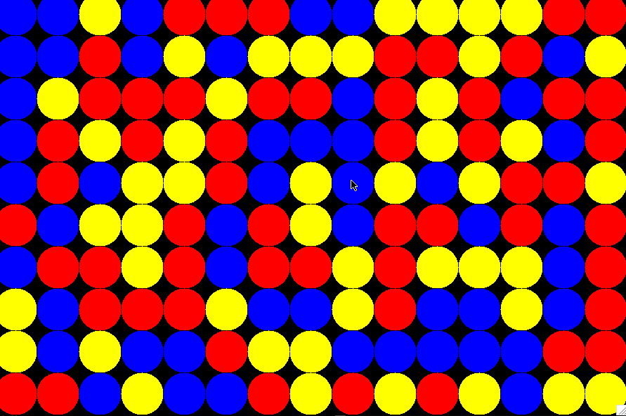
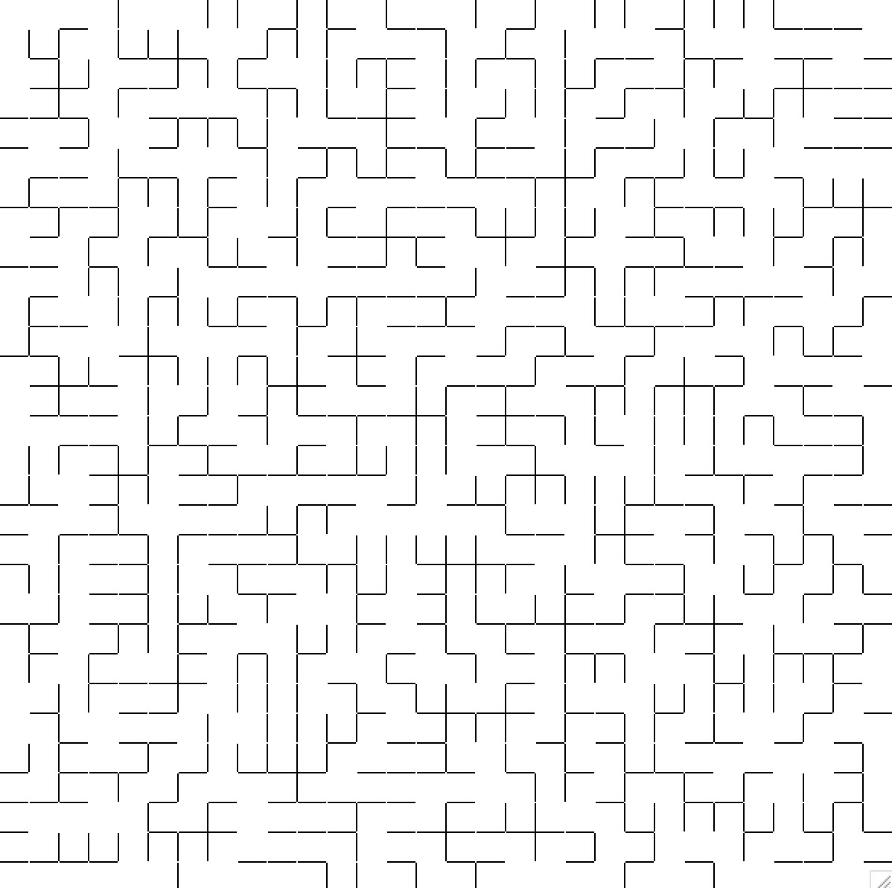
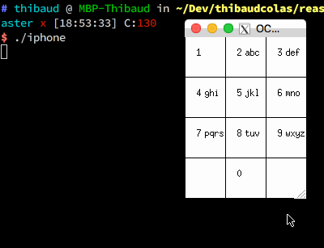

# reason-experiments

> [Reason](https://facebook.github.io/reason/) implementations of small [OCaml](https://ocaml.org) experiments.

## Experiments

### Forest fire cellular automata



```sh
# OCaml version
ocamlbuild -lib graphics src/fire.native
./fire.native
```

This is a simple modelisation of forest fires. Cells are of the types:

- Empty
- Trees
- Fire
- Ashes

Rules are:

- An empty area will stay empty.
- The wind blows ashes away and makes them disappear.
- Fire on a tree transforms it into ashes.
- Trees start burning when one of their neighbours is burning.

### Dragon curve



```sh
# OCaml version
ocamlbuild -lib graphics src/dragon.native
./dragon.native
```

### Mandelbrot fractal



```sh
# OCaml version
ocamlbuild -lib graphics src/mandelbrot.native
./mandelbrot.native
```

### Drag and drop



```sh
# OCaml version
ocamlbuild -lib graphics src/dragndrop.native
./dragndrop.native
```

### Same game



```sh
# OCaml version
ocamlbuild -lib graphics src/same.native
./same.native
```

### Maze generator



```sh
# OCaml version
ocamlbuild -lib graphics src/maze.native
./maze.native
```

### T9 keyboard



```sh
# OCaml version
cd src/t9/
gunzip words.txt.gz
make
./iphone
```

### Wall combinations

```sh
# OCaml version
ocamlbuild -lib graphics src/wall.native
./wall.native
```

### Simple cellular automata

```sh
# OCaml version
ocamlbuild -lib graphics src/cell.native
./cell.native
```

### Abacus calculations

```sh
# OCaml version
ocamlbuild -lib graphics src/abacus.native
./abacus.native
```

## Docs

### Useful links

- [http://www.ocaml-tutorial.org/](http://www.ocaml-tutorial.org/)
- [http://caml.inria.fr/](http://caml.inria.fr/)
- [http://ocamlgraph.lri.fr/](http://ocamlgraph.lri.fr/)
- [http://www.lri.fr/~conchon/](http://www.lri.fr/~conchon/)
